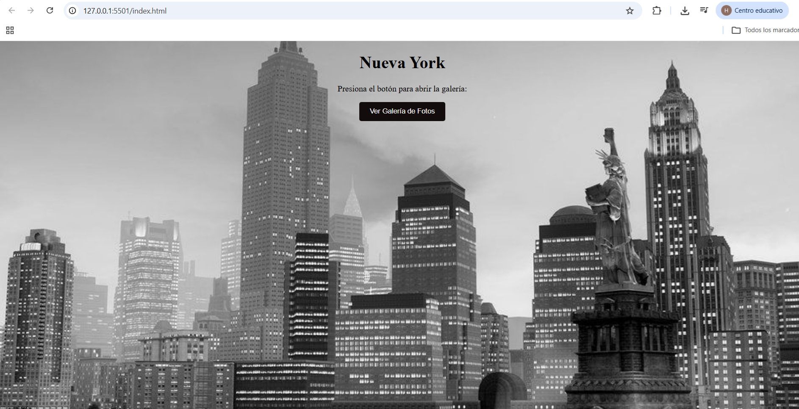
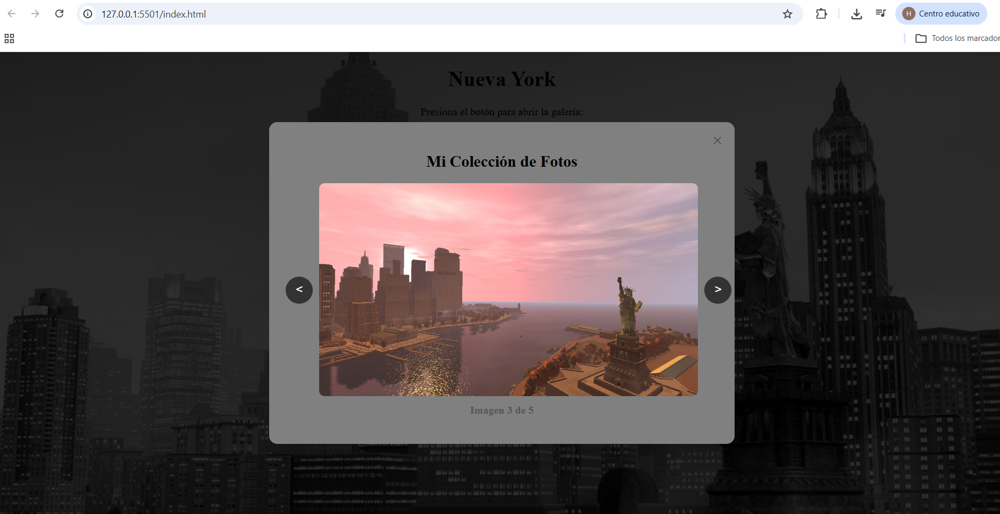

# Actividad 3: Componente Visual - Galería Modal Reutilizable

## 📌 Portada
* **Nombre del Estudiante:** Mendoza Lucero Hasiel Isai
* **Materia:** Programación web
* **Proyecto:** Componentes Visuales


---

## 🚀 Nombre del Componente y Problema que Resuelve
**Nombre:** `ModalGaleria` (Modal Interactivo con Carrusel de Imágenes)

**Problema que resuelve:**  
Cuando un sitio web necesita mostrar una colección de fotografías o detalles multimedia sin redirigir al usuario a otra página ni recargar el navegador, se requiere una interfaz emergente. `ModalGaleria` resuelve este problema proporcionando una ventana modal superpuesta que incluye navegación por carrusel (siguiente/anterior) y contador de imágenes, todo empaquetado en una Clase ES6 reutilizable que puede instanciarse en cualquier proyecto con solo una línea de código.

---

## 🛠️ Instalación

Para incluir este componente en cualquier proyecto HTML, solo debes vincular el archivo de estilos CSS y el script de JavaScript.

1. **Incluir el archivo CSS en el `<head>`:**
   ```html
   <link rel="stylesheet" href="modal.css">
   ```

2. **Incluir el archivo JS antes del cierre de `</body>`:**
   ```html
   <script src="modal.js"></script>
   ```

---

## 💻 Uso con Ejemplos de Código

### 1. Estructura HTML necesaria
Agrega la cortina del modal y los botones de navegación en tu HTML:

```html
<!-- Botón para abrir -->
<button id="btnAbrirGaleria">Ver Galería</button>

<!-- Ventana Modal -->
<div class="cortina-negra" id="modalGaleria">
    <div class="cortina-blanca">
        <span class="botoncerrar" id="btnCerrarGaleria">&times;</span>
        <h2>Mi Colección de Fotos</h2>
        
        <div class="visor-imagen">
            <button id="btnAnterior" class="btn-nav">&lt;</button>
            
            <button id="btnSiguiente" class="btn-nav">&gt;</button>
        </div>

        <p id="textoContador" class="texto-contador"></p>
    </div>
</div>
```

### 2. Inicialización en JavaScript 
Instancia el componente pasándole los IDs del HTML y el arreglo con las rutas de las imágenes:

```javascript
document.addEventListener('DOMContentLoaded', () => {
    // Definir la lista de imágenes
    const fotos = [
        'img/foto1.jpg',
        'img/foto2.jpg',
        'img/foto3.jpg'
    ];

    // Instanciar el componente
    const galeria = new ModalGaleria(
        'modalGaleria',     // ID del overlay
        'btnAbrirGaleria',  // ID del botón para abrir
        'btnCerrarGaleria', // ID del botón X para cerrar
        fotos               // Arreglo de fotos
    );
});
```

---

## Capturas de Pantalla
### 1. Vista Principal con la imagen de fondo


### 2. Componente Modal Abierto con Navegación

